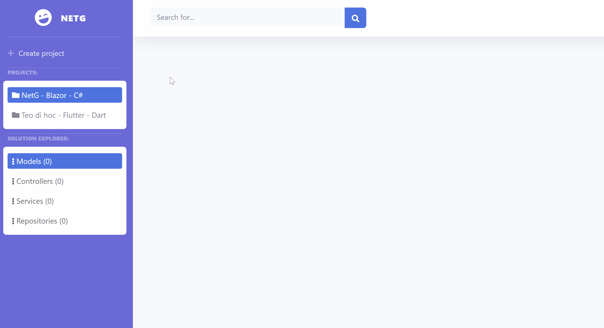

# SkorBlazor.GuidePopup
Guidelines popup for Blazor
### Usage
#### 1.Installation
Nuget: [SkorBlazor.GuidePopup](https://www.nuget.org/packages/SkorBlazor.GuidePopup/)
#### 2.Add service
```csharp
services.AddGuider();
// also use with options
// service.AddGuider(options => {
// options.PopupClassName = "your-class";
///...
//})
```

#### 3.Inject service and use it
```csharp
@inject SkorBlazor.GuidePopup.IGuider Guider
<div ref="showPopupNearMe"></div>
@functions{
    ElementRef showPopupNearMe;
    protected override async Task OnInitAsync()
    {
        Guider.Show("elementId", "Content", GuidePosition.Right);
        // you can use it with ElementRef or X,Y 
        // Guider.Show(showPopupNearMe, "Content", GuidePosition.Bottom);
        // Guider.Show(200, 400, "Content", GuidePosition.TopLeft);
        Guider.OnClosed += OnClosed;
    }
    private void OnClosed(object sender, EventArg args)
    {
        Console.WriteLine("Closed");
    }
}
```
#### Use GuideLines
```csharp
@inject SkorBlazor.GuidePopup.IGuider Guider
<div ref="showPopupNearMe"></div>
@functions{
    ElementRef showPopupNearMe;
    Guider.Make("elementId", "Content", GuidePosition.Right)
          .Make(showPopupNearMe, "Content", GuidePosition.Bottom)
          .Make(300, 300, "Test 3")
          .Start();
}
```
##### Note: The Guider will create new element and add it to inside of `body` tag, when close it will removed. If you have any idea for this package,feel free create new issue on this repository.
#### Demo
